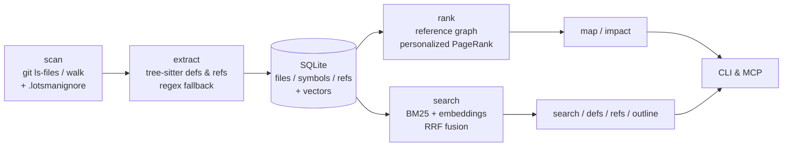

# Lotsman

> A *lotsman* is a maritime pilot — the one who boards a ship and guides it
> through waters they know by heart. Lotsman does the same for AI agents in
> large codebases.

[](https://github.com/rezunenko-yurii/lotsman/actions/workflows/ci.yml)
[](pyproject.toml)
[](LICENSE)
[](CHANGELOG.md)

Local codebase index for AI agents: a PageRank-ranked repo map, hybrid symbol
search (BM25 + local embeddings), reference lookups, a heuristic impact map,
and an MCP server. No API keys, no daemons, no cloud — Python + tree-sitter,
the whole index in a single SQLite file.

**Status: Beta.** Lotsman is a heuristic navigation index for AI agents, not a
compiler-grade code-intelligence engine: it finds *candidates to check*, it
does not prove completeness.

**The problem.** On a large project an agent burns most of its tokens on
navigation: grep cascades, reading whole files for two relevant lines,
re-finding things it already saw. **The approach:** pay once to build a local
index, then answer "where / who uses / what breaks" questions in tens of lines
instead of thousands.

**Measured effect:** a realistic navigation scenario costs **~2.8k tokens
instead of ~67k (24×)** — reproducible via [`benchmarks/`](benchmarks/bench_django.py).
In a live Claude Code session on a Unity project (2008 C# files), the agent
answered an impact question with 4 lotsman calls and a single 15-line file read.

## Quick start

```bash
pip install ".[embeddings]"     # from the repo root; installs the `lotsman` CLI
cd /your/project
lotsman index                   # build the index (seconds; incremental after)
lotsman map --budget 1500       # the most important symbols, token-budgeted
```

Everything degrades gracefully: no `model2vec` → BM25-only search; no
tree-sitter grammar for a language → regex/lexical fallback; not a git repo →
filesystem walk. Run `lotsman doctor` to see exactly what is active.

## What it looks like

`lotsman map` — the repo's skeleton, most-referenced definitions first:

```
lotsman/store.py:
   50: class SymbolRow:
   59: class Store:
  125: def known_files(self) -> dict[str, tuple[str, float, int]]:
  191: def all_symbols(self) -> list[SymbolRow]:
  216: def symbols_named(self, name: str) -> list[SymbolRow]:

lotsman/textutil.py:
    8: def estimate_tokens(text: str) -> int:
```

`lotsman search "fuse rankings from multiple retrievers"` — hybrid search
finds code by meaning, not just by name:

```
  0.02  lotsman/search.py:96   [function] def _rrf(ranked_lists: list[list[Hit]], limit: int) -> list[Hit]:
  0.02  lotsman/indexer.py:43  [function] def index_repo(root: Path, store: Store, verify: bool = False) -> ...
```

`lotsman refs pagerank` — who uses a symbol, before you touch it:

```
defined in:
  lotsman/graph.py:74  [function] def pagerank(
referenced by:
  tests/test_all.py  (2x)
  lotsman/repomap.py  (1x)
```

## Commands

| Command | Answers |
|---|---|
| `lotsman index [--verify] [--no-embed]` | build/update the index (incremental; `--verify` re-hashes everything) |
| `lotsman map [--budget N] [--focus F] [--mention I]` | "how is this project structured; what matters?" |
| `lotsman search "query" [--mode auto\|hybrid\|bm25\|vector]` | "where is the code that does X?" |
| `lotsman outline FILE` | "what's inside this file?" — without reading it |
| `lotsman defs NAME` / `lotsman refs NAME` | "where is it defined / who uses it?" |
| `lotsman impact [FILES...] [--since H]` | "what changed and what depends on it?" (heuristic) |
| `lotsman doctor [--json] [--fail-on-warn]` | "what's active, what degraded, is the index fresh?" — JSON + exit codes for CI/agent gates |
| `lotsman stats` / `lotsman mcp` | index statistics / MCP stdio server |

`--json` on `search` / `outline` / `defs` / `refs` / `index` gives
machine-readable output. The index lives in `.lotsman/index.db` (gitignore it).

Vendored/third-party code is excluded via a `.lotsmanignore` file in the repo
root (gitignore-lite globs; `dir/` matches the subtree) — essential for Unity
(`Plugins/`) and monorepos with vendored SDKs. Minified/generated files (lines
over 1000 chars) are filtered automatically.

Languages with precise tree-sitter extraction: python, javascript, typescript,
tsx, go, rust, java, c, cpp, ruby, csharp, php; anything else falls back to
regex/lexical heuristics.

## Hooking it up to an agent

Three integration levels, from lightest to deepest:

**1. CLAUDE.md policy** — teach the agent to prefer the index over reading:

```markdown
## Code navigation: lotsman

Use `lotsman` before reading files (cheaper and faster than reading):
1. New task in unfamiliar territory -> `lotsman map --budget 1500 --mention <identifier>`
2. "Where is the code that does X?"  -> `lotsman search "X"` instead of grep chains
3. "What's in this file?"            -> `lotsman outline <file>`, then read only the range
4. "Who uses / where is it defined?" -> `lotsman refs <name>` / `lotsman defs <name>`
5. Before editing shared code        -> `lotsman impact <files>`
6. Read a whole file only after outline/search confirmed it's the right one.
```

**2. MCP server** — typed tools instead of shell commands. `.mcp.json`:

```json
{"mcpServers": {"lotsman": {
  "command": "lotsman", "args": ["--repo", ".", "mcp"]}}}
```

The server keeps the index fresh itself (throttled incremental reindex) and is
implemented on the stdlib as a deliberate protocol subset (initialize,
tools/list, tools/call, ping). **Verified clients:** Claude Code 2.1.150 —
`.mcp.json` launch, handshake, tool calls, and a live agent session (see
[docs/DEVLOG.md](docs/DEVLOG.md)). Other MCP clients should work but are
untested; if one breaks on a lifecycle nuance, file an issue with the
JSON-RPC transcript.

**3. Session-start map injection** — the agent starts every session already
holding the map. `.claude/settings.json`:

```json
{"hooks": {"SessionStart": [{"matcher": "startup|clear", "hooks": [{
  "type": "command",
  "command": "echo '## Repo map (lotsman):'; lotsman map --budget 1200 2>/dev/null"
}]}]}}
```

With a warm rank cache the hook costs ~0.1–0.3 s.

## How it works



1. **Scan** — `git ls-files` when available, filesystem walk otherwise;
   language detection, size/vendor/generated filters.
2. **Extract** — tree-sitter queries for definitions (12 languages) and
   *use-site* references — calls, instantiations, inheritance, attributes,
   type usages (11 languages). A parameter named `request` is not a reference
   to a `request()` method.
3. **Store** — SQLite with incremental upsert (sha256 + mtime fast path;
   `--verify` re-hashes everything). Index-format changes trigger an automatic
   full rebuild.
4. **Rank** — a file→file reference graph weighted by
   `boost(name) × IDF(name) × √count / definers`; names referenced by >25% of
   files are dropped as ambient vocabulary. Personalized PageRank distributes
   file rank down to individual definitions; results are cached per index state.
5. **Map** — greedy selection of top-ranked definitions under a token budget.
6. **Search** — Okapi BM25 over symbol documents (name subtokens + signature +
   path) fused with cosine similarity over local static embeddings
   ([model2vec](https://github.com/MinishLab/model2vec), no torch) via
   Reciprocal Rank Fusion; test paths demoted, duplicate signatures collapsed.

Design rationale and the cost model: [docs/DESIGN.md](docs/DESIGN.md).
Numbers: [docs/BENCHMARKS.md](docs/BENCHMARKS.md).

## Honest limitations

- **`refs`/`impact` are heuristic, not compiler-grade.** `obj.method()` is
  matched to definitions by name, without type resolution — same-named methods
  of different classes blur together. IDF weighting, the ambient-vocabulary
  cutoff and builtin stopwords absorb most of the noise, but treat `impact`
  output as candidates to re-check, not a complete blast radius: DI wiring,
  reflection, codegen, serialized/scene references stay invisible to
  name-based analysis. For php, references are lexical (no ref query yet).
- **Static embeddings** catch related vocabulary and word forms, not deep
  paraphrases. Swap the model via `LOTSMAN_EMBED_MODEL`.
- **One repo = one index.** No cross-repository references.
- The mtime+size fast path can theoretically miss a change that preserves both
  timestamp and size — `lotsman index --verify` exists precisely for that.

## Development

```bash
python -m unittest discover -s tests   # 56 tests across layered files, no test-only deps
python benchmarks/bench_django.py      # reproducible perf numbers + quality gates
lotsman doctor --json                  # environment health, machine-readable
```

License: [MIT](LICENSE). Changes: [CHANGELOG.md](CHANGELOG.md).
