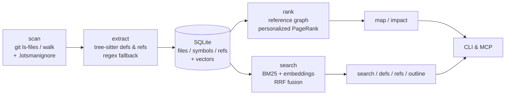

# Lotsman

> A *lotsman* is a maritime pilot — the one who boards a ship and guides it
> through waters they know by heart. Lotsman does the same for AI agents in
> large codebases.

[](https://github.com/rezunenko-yurii/lotsman/actions/workflows/ci.yml)
[](pyproject.toml)
[](LICENSE)
[](CHANGELOG.md)

Local codebase index for AI agents: a PageRank-ranked repo map, hybrid symbol
search (BM25 + local embeddings), reference lookups, a heuristic impact map,
and an MCP server. No API keys, no daemons, no cloud — Python + tree-sitter,
the whole index in a single SQLite file.

**Status: Beta.** Lotsman is a heuristic navigation index for AI agents, not a
compiler-grade code-intelligence engine: it finds *candidates to check*, it
does not prove completeness.

**The problem.** On a large project an agent burns most of its tokens on
navigation: grep cascades, reading whole files for two relevant lines,
re-finding things it already saw. **The approach:** pay once to build a local
index, then answer "where / who uses / what breaks" questions in tens of lines
instead of thousands.

**Measured effect:** a realistic navigation scenario costs **~2.8k tokens
instead of ~67k (24×)** — reproducible via [`benchmarks/`](benchmarks/bench_django.py).
In a live Claude Code session on a Unity project (2008 C# files), the agent
answered an impact question with 4 lotsman calls and a single 15-line file read.

## Navigation

- [Quick start](#quick-start)
- [Operating model: deep index, narrow retrieval](#operating-model-deep-index-narrow-retrieval)
- [Showcase: five minutes in an unfamiliar codebase](#showcase-five-minutes-in-an-unfamiliar-codebase)
- [Commands](#commands)
- [Hooking it up to an agent](#hooking-it-up-to-an-agent)
- [How it works](#how-it-works)
- [Honest limitations](#honest-limitations)
- [Development](#development)

## Quick start

```bash
pip install "lotsman[embeddings] @ git+https://github.com/rezunenko-yurii/lotsman"
cd /your/project
lotsman init --agent codex      # policy in AGENTS.md, .lotsmanignore skeleton,
                                # Codex MCP registration hint, first index + warm cache
lotsman map --budget 1500       # the most important symbols, token-budgeted
```

`init` is idempotent and preserves existing AGENTS.md / .mcp.json content.
Per-agent setup (Claude Code, Codex, Cursor, generic CLI agents) and workflow
lifehacks: [docs/INTEGRATIONS.md](docs/INTEGRATIONS.md).

Everything degrades gracefully: no `model2vec` → BM25-only search; no
tree-sitter grammar for a language → regex/lexical fallback; not a git repo →
filesystem walk. Run `lotsman doctor` to see exactly what is active.

## Operating model: deep index, narrow retrieval

Lotsman deliberately separates **how much the machine knows** from **how much
text the agent sees**.

The local index is deep: `index` scans the whole repo, extracts symbols and
references, stores vectors when embeddings are installed, and keeps the result
in `.lotsman/index.db`. That work costs local CPU/disk, not agent context.

Retrieval is narrow: `map`, `search`, `outline`, `defs`, `refs`, and `impact`
return small, task-shaped slices. The agent should start with a compact map,
then ask for more detail only when the task demands it.

Map output size is controlled by budget and focus:

| Intent | Command shape | Use when |
|---|---|---|
| Small slice | `lotsman map --budget 800` | first look at a repo |
| Normal slice | `lotsman map --budget 1500` | default session start |
| Wider slice | `lotsman map --budget 3000` | broad unfamiliar area |
| Focused slice | `lotsman map --budget 5000 --mention Billing` | one subsystem or task |
| File-centered slice | `lotsman map --budget 5000 --focus app/billing.py --mention Refund` | one file is already in context |

Large map outputs are not deeper indexing; they are simply more text returned
to the agent. Prefer a full local index plus small retrieval slices. Increase
the map budget only when the agent genuinely needs a broader view.

Index freshness is automatic for normal use:

- `init` builds the first index and warms the rank cache.
- CLI read commands (`map`, `search`, `outline`, `defs`, `refs`, `impact`)
  run an incremental refresh before serving results, so a pull or edit does
  not leave stale line numbers in normal CLI use.
- The MCP server keeps its index fresh with a throttled incremental refresh
  while serving tools.
- `doctor` reports the health state explicitly; use `index --verify` when you
  want a full re-hash instead of the normal mtime/size fast path.

## Showcase: five minutes in an unfamiliar codebase

The corpus below is **Django 5.2 — 2272 files, ~41k symbols**. Every output is
real (reproduce any of it: `git clone --depth 1 --branch 5.2
https://github.com/django/django && cd django && lotsman init`). The premise:
you (or your agent) have never seen this codebase and need to work in it.

### Step 0 — one command to onboard

```
$ lotsman init --agent claude
[init] policy in AGENTS.md: created
[init] created .lotsmanignore skeleton (edit it to exclude vendored code)
[init] added .lotsman/ to .gitignore
[init] claude: registered MCP server in .mcp.json
[init] indexed 2272 files (40838 symbols embedded), rank cache warmed
[init] done — try: lotsman map --budget 1500
```

Indexing 2272 files takes ~4 s once; every later reindex touches only changed
files (~0.1 s). CLI read commands refresh incrementally before serving
results. From here on, every command below answers in **under 0.2 s** on a warm
index.

### Step 1 — get your bearings: `lotsman map`

```
$ lotsman map --budget 380
django/utils/functional.py:
    7: class cached_property:
   68: class Promise:
  211: def keep_lazy(*resultclasses):

django/core/exceptions.py:
  119: class ImproperlyConfigured(Exception):
  134: class ValidationError(Exception):

django/db/models/sql/query.py:
  159: def chain(self, using):

django/test/testcases.py:
  204: class SimpleTestCase(unittest.TestCase):
 1362: class TestCase(TransactionTestCase):
```

This is not a directory listing — it's PageRank over the *reference graph*:
the definitions the rest of the codebase actually leans on. Ten seconds of
reading tells you Django's load-bearing walls are lazy evaluation
(`cached_property`, `Promise`), a central exception pair, the SQL query
builder, and the test base classes. A human needs days to build this intuition;
reading files to reproduce it would cost tens of thousands of tokens.

### Step 2 — make the map about *your task*: `--mention`

Task: "something about validation errors." Bias the ranking:

```
$ lotsman map --budget 220 --mention ValidationError
django/utils/hashable.py:
    4: def make_hashable(value):

django/core/exceptions.py:
  119: class ImproperlyConfigured(Exception):
  134: class ValidationError(Exception):
```

The whole graph re-ranks around the identifier you care about (`--focus
some/file.py` does the same for files already in context — the map shows their
*dependencies* instead of repeating them). This flag is the difference between
"a map of the project" and "a map of my problem".

### Step 3 — find code by meaning: `lotsman search`

```
$ lotsman search "validate unique fields model" -k 4
  0.03  django/db/models/fields/__init__.py:798  [function] def validate(self, value, model_instance):
  0.03  django/forms/fields.py:185   [function] def validate(self, value):
  0.03  django/forms/models.py:803   [function] def validate_unique(self):
  0.02  django/db/models/base.py:1394 [function] def validate_unique(self, exclude=None):
```

Hybrid BM25 + embedding search over *symbols* (not raw text): it lands on
definitions with `path:line`, ready to open at the exact spot — instead of a
grep that returns 400 matching lines across tests and docs.

### Step 4 — look inside without reading: `lotsman outline`

```
$ lotsman outline django/core/paginator.py
django/core/paginator.py:
   15-16    [class] class InvalidPage(Exception):
   27-178   [class] class Paginator:
   37-54    [function] def __init__(
   60-72    [function] def validate_number(self, number):
   74-85    [function] def get_page(self, number):
  106-111   [function] def count(self):
  114-119   [function] def num_pages(self):
```

The file's skeleton with line ranges. You (or the agent) now read *lines
60–85*, not the whole file. This single habit is where most of the token
savings comes from.

### Step 5 — who depends on this: `lotsman refs`

```
$ lotsman refs cached_property
defined in:
  django/utils/functional.py:7  [class] class cached_property:
referenced by (name-based matching, no type resolution):
  django/db/backends/mysql/features.py  (29x)
  django/db/models/options.py  (22x)
  django/db/models/expressions.py  (12x)
```

Usage ranked by intensity, with the honesty label in the output itself.

### Step 6 — before you change anything: `lotsman impact`

```
$ lotsman impact django/core/paginator.py
note: heuristic, name-based matching (no type resolution) — may miss
reflection/DI/codegen and type-resolved usages
Changed files (1):

django/core/paginator.py:
   27: class Paginator:                        <- used by others 40x
   60: def validate_number(self, number):      <- used by others 10x
   87: def page(self, number):                 <- used by others 11x

Impacted files (249):
  tests/pagination/tests.py — uses Paginator (30x), validate_number (10x), page (8x)
  ...
```

One command turns "I'll rename this method" into "this method has 249
candidate dependents, starting with these" — *before* the tests break, not
after. Without arguments, `impact` auto-detects recent changes (git status, or
an mtime window on non-git repos like Plastic SCM).

### Step 7 — trust, but verify: `lotsman doctor`

```
$ lotsman doctor
[+] languages (ok)
    csharp       defs: tree-sitter      refs: tree-sitter
    python       defs: tree-sitter      refs: tree-sitter
[+] embeddings (ok)
    model loaded, 256 dimensions
[!] index (warn)
    stale: 5 changed/new since last index — run `lotsman index`
```

Every silent degradation made loud. `--json --fail-on-warn` turns this into a
CI/agent gate.

### What this replaces

| Question | Without lotsman | With lotsman |
|---|---|---|
| "How is this project structured?" | hours of reading, ~10⁴–10⁵ tokens | `map`, 0.1 s, ≤ your budget |
| "Where is X handled?" | grep cascade, 3–10 file reads | `search`, one shot, `path:line` |
| "What's in this file?" | read 2000 lines | `outline`, read 25 lines |
| "Safe to change this?" | find out from broken tests | `impact`, candidates up front |

Measured end-to-end on a real navigation task: **~2.8k tokens vs ~67k (24×)**
— reproducible via `python benchmarks/bench_django.py`.

## What an agent session looks like

With the policy from `lotsman init` (and optionally the MCP server), an agent
asked *"where is NodeBehaviour defined, who uses it, and what would a change
affect?"* on a 2008-file Unity project answered in 31 seconds with:

> **Read 1 file, called lotsman 4 times**

— definition at exact `path:line`, all 74 usages grouped by domain, the
heaviest consumer flagged, and a change-risk summary. The equivalent
grep-and-read cascade reads dozens of files into context and keeps paying for
them on every subsequent turn. That live session, plus the reproducible
numbers, are documented in [docs/BENCHMARKS.md](docs/BENCHMARKS.md).

## Commands

| Command | Answers |
|---|---|
| `lotsman init [--agent claude\|codex\|cursor] [--no-index]` | set up AGENTS.md policy, ignore files, per-agent MCP setup/instructions, and the first index |
| `lotsman index [--verify] [--no-embed]` | build/update the index (incremental; `--verify` re-hashes everything) |
| `lotsman map [--budget N] [--focus F] [--mention I]` | "how is this project structured; what matters?" |
| `lotsman search "query" [--mode auto\|hybrid\|bm25\|vector]` | "where is the code that does X?" |
| `lotsman outline FILE` | "what's inside this file?" — without reading it |
| `lotsman defs NAME` / `lotsman refs NAME` | "where is it defined / who uses it?" |
| `lotsman impact [FILES...] [--since H]` | "what changed and what depends on it?" (heuristic) |
| `lotsman doctor [--json] [--fail-on-warn]` | "what's active, what degraded, is the index fresh?" — JSON + exit codes for CI/agent gates |
| `lotsman stats` / `lotsman mcp` | index statistics / MCP stdio server |

`--json` on `search` / `outline` / `defs` / `refs` / `index` gives
machine-readable output. The index lives in `.lotsman/index.db` (gitignore it).
CLI read commands keep that index fresh with an incremental pass;
`index --verify` is still available when you need a full re-hash.

Vendored/third-party code is excluded via a `.lotsmanignore` file in the repo
root (gitignore-lite globs; `dir/` matches the subtree) — essential for Unity
(`Plugins/`) and monorepos with vendored SDKs. Minified/generated files (lines
over 1000 chars) are filtered automatically.

Languages with precise tree-sitter extraction: python, javascript, typescript,
tsx, go, rust, java, c, cpp, ruby, csharp, php; anything else falls back to
regex/lexical heuristics.

## Hooking it up to an agent

Full per-agent guide with lifehacks: [docs/INTEGRATIONS.md](docs/INTEGRATIONS.md).
Three integration levels, from lightest to deepest:

**1. AGENTS.md policy** (written by `lotsman init`) — teach the agent to
prefer the index over reading:

```markdown
## Code navigation: lotsman

Use `lotsman` before reading files (cheaper and faster than reading):
1. New task in unfamiliar territory -> `lotsman map --budget 1500 --mention <identifier>`
2. "Where is the code that does X?"  -> `lotsman search "X"` instead of grep chains
3. "What's in this file?"            -> `lotsman outline <file>`, then read only the range
4. "Who uses / where is it defined?" -> `lotsman refs <name>` / `lotsman defs <name>`
5. Before editing shared code        -> `lotsman impact <files>`
6. Read a whole file only after outline/search confirmed it's the right one.
```

**2. MCP server** — typed tools instead of shell commands. `.mcp.json`:

```json
{"mcpServers": {"lotsman": {
  "command": "lotsman", "args": ["--repo", ".", "mcp"]}}}
```

The server keeps the index fresh itself (throttled incremental reindex) and is
implemented on the stdlib as a deliberate protocol subset (initialize,
tools/list, tools/call, ping). **Verified clients:** Claude Code 2.1.150 —
`.mcp.json` launch, handshake, tool calls, and a live agent session (see
[docs/DEVLOG.md](docs/DEVLOG.md)). Other MCP clients should work but are
untested; if one breaks on a lifecycle nuance, file an issue with the
JSON-RPC transcript.

**3. Session-start map injection** — the agent starts every session already
holding the map. `.claude/settings.json`:

```json
{"hooks": {"SessionStart": [{"matcher": "startup|clear", "hooks": [{
  "type": "command",
  "command": "echo '## Repo map (lotsman):'; lotsman map --budget 1200 2>/dev/null"
}]}]}}
```

With a warm rank cache the hook costs ~0.1–0.3 s.

## How it works



1. **Scan** — `git ls-files` when available, filesystem walk otherwise;
   language detection, size/vendor/generated filters.
2. **Extract** — tree-sitter queries for definitions (12 languages) and
   *use-site* references — calls, instantiations, inheritance, attributes,
   type usages (11 languages). A parameter named `request` is not a reference
   to a `request()` method.
3. **Store** — SQLite with incremental upsert (sha256 + mtime fast path;
   `--verify` re-hashes everything). Index-format changes trigger an automatic
   full rebuild.
4. **Rank** — a file→file reference graph weighted by
   `boost(name) × IDF(name) × √count / definers`; names referenced by >25% of
   files are dropped as ambient vocabulary. Personalized PageRank distributes
   file rank down to individual definitions; results are cached per index state.
5. **Map** — greedy selection of top-ranked definitions under a token budget.
6. **Search** — Okapi BM25 over symbol documents (name subtokens + signature +
   path) fused with cosine similarity over local static embeddings
   ([model2vec](https://github.com/MinishLab/model2vec), no torch) via
   Reciprocal Rank Fusion; test paths demoted, duplicate signatures collapsed.

Design rationale and the cost model: [docs/DESIGN.md](docs/DESIGN.md).
Numbers: [docs/BENCHMARKS.md](docs/BENCHMARKS.md).

## Honest limitations

- **`refs`/`impact` are heuristic, not compiler-grade.** `obj.method()` is
  matched to definitions by name, without type resolution — same-named methods
  of different classes blur together. IDF weighting, the ambient-vocabulary
  cutoff and builtin stopwords absorb most of the noise, but treat `impact`
  output as candidates to re-check, not a complete blast radius: DI wiring,
  reflection, codegen, serialized/scene references stay invisible to
  name-based analysis. For php, references are lexical (no ref query yet).
- **Static embeddings** catch related vocabulary and word forms, not deep
  paraphrases. Swap the model via `LOTSMAN_EMBED_MODEL`.
- **One repo = one index.** No cross-repository references.
- The mtime+size fast path can theoretically miss a change that preserves both
  timestamp and size — `lotsman index --verify` exists precisely for that.

## Development

```bash
python -m unittest discover -s tests   # layered test suite, no test-only deps
python benchmarks/bench_django.py      # reproducible perf numbers + quality gates
lotsman doctor --json                  # environment health, machine-readable
```

License: [MIT](LICENSE). Changes: [CHANGELOG.md](CHANGELOG.md).
