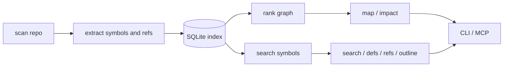

# Lotsman

> A local code map for AI agents.

[](https://github.com/rezunenko-yurii/lotsman/actions/workflows/ci.yml)
[](pyproject.toml)
[](LICENSE)
[](CHANGELOG.md)

Lotsman helps AI agents understand large codebases without reading half the
repo into context. It builds a local SQLite index, then returns small,
task-shaped answers: important symbols, likely files, file outlines,
definitions, references, and heuristic impact.

No API keys. No cloud. No daemon. Python, tree-sitter, optional local
embeddings, and one `.lotsman/index.db` per repo.

**Status: Beta.** Lotsman is a navigation tool, not a compiler or LSP. It finds
candidates to inspect; it does not prove complete semantic truth.

## Navigation

- [Like You Are 5](#like-you-are-5)
- [Why Agents Need It](#why-agents-need-it)
- [Should You Use It?](#should-you-use-it)
- [What Changed In 1.5](#what-changed-in-15)
- [Quick Start](#quick-start)
- [Daily Workflow](#daily-workflow)
- [Updating Lotsman And Generated Agent Files](#updating-lotsman-and-generated-agent-files)
- [Tiny Example](#tiny-example)
- [What Comes Back](#what-comes-back)
- [How It Differs From Grep, LSP, And Ctags](#how-it-differs-from-grep-lsp-and-ctags)
- [Evidence](#evidence)
- [Language Fit](#language-fit)
- [Agent Setup](#agent-setup)
- [How It Works](#how-it-works)
- [Command Reference](#command-reference)
- [Limits](#limits)
- [Development](#development)

## Like You Are 5

Imagine an agent walking into a huge library.

Without Lotsman, it opens many books just to find one paragraph. With Lotsman,
it first asks the card catalog:

- "What are the important books here?"
- "Where is the paragraph about refunds?"
- "What chapters are inside this book?"
- "Who else mentions this name?"

The agent still reads code. It just reads the right small piece first.

## Why Agents Need It

Agents waste a surprising amount of context on navigation:

- broad grep chains;
- whole-file reads for a few relevant lines;
- repeated rediscovery of the same symbols;
- guessing what a change might affect only after tests fail.

Lotsman changes the loop:

1. Build a local index once.
2. Ask narrow questions.
3. Read only the relevant line range.
4. Treat impact/reference output as a candidate list to verify.

That is the product promise: **less context spent on finding code, more context
left for reasoning about code.**

## Should You Use It?

| Use Lotsman if... | Skip it if... |
|---|---|
| Your repo is large, unfamiliar, or mixed-language. | Your project is tiny and the agent rarely gets lost. |
| Agents often read whole files just to find one function. | You need compiler-grade type resolution or guaranteed impact analysis. |
| You want fast candidate lists before editing. | You need a cross-repository semantic graph. |
| Your project has stable domain names across layers. | You cannot create a local `.lotsman/` index in the repo. |
| You can ignore generated/vendor/copied dependency trees. | You expect runtime reflection, DI, scenes, or config wiring to be proven complete. |

Lotsman is best as an agent navigation layer. It complements grep, LSPs and
tests; it does not replace them.

## What Changed In 1.5

v1.5 is the "read less after finding it" release. Earlier Lotsman was already
good at pointing agents at the right file or symbol; this release makes the
next step narrower and easier to audit.

| Added / improved | What it changes for agents |
|---|---|
| `lotsman slice FILE NAME` | returns one symbol body plus a file skeleton, so the agent does not have to read the whole file after `outline` |
| MCP `slice` tool | gives the same read-less workflow to MCP clients |
| `refs Class.Method` | intersects names like `CheckoutService` and `refund`, reducing noise from same-named methods |
| `.lotsman/wiring.json` | lets DI/reflection/config strings add candidate references with project-specific regex patterns |
| `impact --tests` | filters impacted dependents down to likely test files when the agent needs a re-check shortlist |
| `LOTSMAN_QUERYLOG=1` + `lotsman report` | records local MCP query patterns so teams can see what agents actually ask and where answers are empty |

Measured profit: the existing corpus benchmarks still show **7x-51x
navigation-token savings** on real repos, with all quality gates passing on
v1.5. The headline ratios did not jump just because the version changed:
the benchmark scenarios already modeled narrow reading. The v1.5 gain is that
the narrow-read behavior is now a first-class command/tool (`slice`), refs can
be focused, impacted tests can be shortlisted, DI blind spots can be mitigated,
and query behavior can be measured locally.

## Quick Start

```bash
pip install "lotsman[embeddings] @ git+https://github.com/rezunenko-yurii/lotsman"
cd /your/project
lotsman init --agent codex
lotsman map --budget 1500
```

`init` is idempotent. It can add an agent policy, a `.lotsmanignore` skeleton,
MCP hints, a project-local skill for supported agents, the first index, and a
warm map cache.

Use the agent flag that matches your tool:

```bash
lotsman init --agent codex
lotsman init --agent claude
lotsman init --agent cursor
```

More setup detail lives in [docs/INTEGRATIONS.md](docs/INTEGRATIONS.md).

## Daily Workflow

Start small. Widen only when the task needs it.

| You need to know | Ask Lotsman |
|---|---|
| What matters in this repo? | `lotsman map --budget 1500` |
| What matters around billing/refunds/etc.? | `lotsman map --mention Billing --budget 2500` |
| Where is behavior X implemented? | `lotsman search "validate unique fields model"` |
| What is inside this file? | `lotsman outline path/to/file.py` |
| Where is this symbol defined? | `lotsman defs SomeName` |
| Who probably uses this class method? | `lotsman refs CheckoutService.refund` |
| Read one symbol body without the whole file? | `lotsman slice billing/refunds.py refund` |
| What might my edit affect, including tests? | `lotsman impact path/to/changed_file.py --tests` |
| What have we actually been asking Lotsman? | `lotsman report` |
| Is the environment/index healthy? | `lotsman doctor` |

The agent pattern is:

```text
map/search -> outline/slice -> read only the relevant lines -> edit -> impact/tests/report
```

## Updating Lotsman And Generated Agent Files

There are two things to keep fresh:

1. **The index** in `.lotsman/index.db`, which reflects your project source.
2. **Generated agent files**, such as `AGENTS.md` managed blocks and
   `.codex/skills/lotsman-navigation/SKILL.md`, which reflect the installed
   Lotsman version.

When only project source changed, the normal read commands auto-refresh
incrementally, and this is enough:

```bash
lotsman index
```

When Lotsman itself was upgraded, or you want the latest generated skills and
agent policy, run:

```bash
lotsman update
```

`update` auto-detects existing supported agent artifacts and refreshes them.
It also updates the index and warms the map cache, like `init`.

Use `--no-index` when you only want generated files:

```bash
lotsman update --no-index
```

Use `--agent` when adding or forcing one integration:

```bash
lotsman update --agent codex --no-index
```

Generated skill files are treated as managed artifacts: if Lotsman ships a new
template, `update` replaces the old generated file. Put project-specific
navigation rules in `AGENTS.md` outside the Lotsman managed block, or in your
own separate skill, if you need local custom behavior to survive updates.

## Tiny Example

The output is intentionally boring: short paths, line numbers and signatures.
That is the point.

```text
$ lotsman map --budget 400
django/utils/functional.py:
    7: class cached_property:

django/core/exceptions.py:
  134: class ValidationError(Exception):
```

```text
$ lotsman search "validate unique fields model" -k 3
django/forms/models.py:803       def validate_unique(self):
django/db/models/base.py:1394    def validate_unique(self, exclude=None):
django/db/models/fields/__init__.py:798  def validate(self, value, model_instance):
```

```text
$ lotsman outline django/db/models/base.py
django/db/models/base.py:
 1394-1402  def validate_unique(self, exclude=None):
 1404-1460  def _get_unique_checks(...)
 1462-1516  def _perform_unique_checks(...)
```

Now the agent reads the relevant range, not the whole file.

## What Comes Back

Lotsman indexes deeply, but returns slices. The local machine can know a lot;
the agent should only see the next useful piece.

| Slice | Returns | Does not return | Use when |
|---|---|---|---|
| `map --budget N` | Ranked `path:line` symbols and signatures | Function bodies or all symbols | You need orientation |
| `map --mention X` | A map re-ranked around a term | A saved subsystem summary | You know the feature/domain/API word |
| `map --focus file.py` | A map biased by a file already in context | A file outline | You need surrounding dependencies |
| `search "query"` | Candidate definitions by name/meaning | Raw grep lines or bodies | You need likely implementation locations |
| `outline file.py` | Symbols and line ranges in one file | File contents | You want to choose a line range |
| `defs NAME` | Definitions of a symbol name | Usage sites | You need declarations |
| `refs NAME` | Name-based usage candidates | Type-resolved proof | You need places to inspect |
| `impact files...` | Candidate affected files/symbols | Complete blast radius | You need a test/check shortlist |

Map budget is output budget, not index depth. `map --budget 5000` gives the
agent more text; it does not make the index more complete.

## How It Differs From Grep, LSP, And Ctags

| Tool | Good at | Not enough when... | Lotsman angle |
|---|---|---|---|
| `grep` / `ripgrep` | Exact text search | The agent does not know the exact word or gets hundreds of hits | Search symbols and return small ranked candidates |
| `ctags` | Jumping to definitions | You need task-shaped repo orientation or impact candidates | Adds ranking, maps, outlines and refs |
| LSP | Editor-grade local code intelligence | The agent needs token-budgeted summaries across many files | Keeps output compact and agent-oriented |
| Sourcegraph-like tools | Cross-repo search and browsing | You need a cheap local index with no service/cloud dependency | Runs locally per repo |
| Lotsman | Agent navigation under context budget | You need complete type proof or runtime wiring | Produces candidates to inspect and verify |

Lotsman is not trying to be the only code tool. It is the cheap local navigator
an agent calls before it starts reading.

## Evidence

Current evidence is reproducible navigation scenarios on real repos, plus one
live agent session. This is evidence for code-navigation tasks, not a universal
speedup guarantee.

| Corpus | Shape | Scenario token savings |
|---|---|---|
| Django 5.2 | Python web framework | 24x |
| WordPress 7.0 | PHP CMS core | 51x |
| Vite v5.4.11 | TypeScript monorepo | 14x |
| Gin v1.10.0 | Go web framework | 7x |
| ripgrep 14.1.1 | Rust workspace/CLI | 31x |

Current v1.5 reference run, rerun on 2026-07-08:

| Corpus | Cold index | Warm map | Search | Quality gates |
|---|---:|---:|---:|---|
| Django 5.2 | 3.79 s | 0.07 s | 0.54 s | PASS |
| WordPress 7.0 | 2.12 s | 0.02 s | 0.13 s | PASS |
| Vite v5.4.11 | 0.48 s | 0.00 s | 0.03 s | PASS |
| Gin v1.10.0 | 0.16 s | 0.00 s | 0.01 s | PASS |
| ripgrep 14.1.1 | 0.37 s | 0.00 s | 0.04 s | PASS |

Live evidence: in a Claude Code session on a 2008-file Unity project, an agent
answered an impact question with 4 lotsman calls and one 15-line file read.

The honest reading:

- These are navigation-token savings, not guaranteed end-to-end task speedups.
- Lotsman helps most when navigation would otherwise require long files or many
  candidate files.
- Small, tidy projects still benefit, but the token ratio is lower.
- Vendor-heavy repos need `.lotsmanignore` hygiene before the map is useful.
- Stronger productivity claims require repeated A/B agent runs.

Full numbers, quality gates, and the evidence model:
[docs/BENCHMARKS.md](docs/BENCHMARKS.md).

## Language Fit

Lotsman works best when code has stable named symbols in ordinary source files.

| Fit | Languages / files | What you get |
|---|---|---|
| Best | Python, JavaScript, TypeScript/TSX, Go, Rust, Java, C/C++, Ruby, C#, PHP | tree-sitter definitions; tree-sitter references except PHP, where references are lexical today |
| Useful fallback | Kotlin, Swift, Scala, Lua, Bash and other source-like text | file discovery, regex definitions where patterns match, lexical identifiers |
| Needs cleanup | minified bundles, generated code, vendored SDKs, copied dependencies | noisy maps unless ignored |
| Out of scope | cross-repo type resolution, runtime reflection, DI wiring, serialized scene refs | candidate discovery only |

Practical rule: keep your index broad, but keep your corpus clean. Put vendor,
generated, minified and asset-heavy trees in `.lotsmanignore`.

### Mixed-Language Repos

Mixed-language repos are normal for Lotsman. One repository still gets one
`.lotsman/index.db`; Python, TypeScript, Go, Rust, C#, PHP and other supported
files are indexed together.

What works well:

- `map` can show important symbols across all indexed languages;
- `search "refund validation"` can surface backend, frontend and worker code
  when names and paths share domain vocabulary;
- `outline` remains precise because it works inside one file at a time;
- `defs` is useful for exact names, even when `search` is noisy.

What stays heuristic:

- `refs` and `impact` match by names across the shared index; they do not prove
  real cross-language runtime links;
- generated bindings, serialized scene/prefab references, reflection, DI and
  config-driven wiring may be invisible unless you seed stable names through
  `wiring.json` as described in [docs/INTEGRATIONS.md](docs/INTEGRATIONS.md);
- cross-repository contracts are out of scope unless the code is in the same
  indexed repo.

Best result: keep domain names stable across layers (`Invoice`,
`CheckoutSession`, `RefundPolicy`) and ignore copied/generated dependency
trees.

## Agent Setup

Lotsman can be used through plain CLI or MCP.

### 1. Agent Policy

`lotsman init --agent codex` or `--agent claude` teaches the agent to navigate
with Lotsman before broad file reads.

The policy is intentionally simple:

```text
Unfamiliar task -> map
Find behavior   -> search
Inspect file    -> outline, then read the range
Change symbol   -> refs / impact
```

### 2. MCP Tools

MCP gives agents typed tools instead of shell commands:

```json
{
  "mcpServers": {
    "lotsman": {
      "command": "lotsman",
      "args": ["--repo", ".", "mcp"]
    }
  }
}
```

The MCP server keeps the index fresh with throttled incremental refresh.
Verified client: Claude Code 2.1.150. Other clients should work, but are less
tested.

### 3. Session Map Injection

Some agents can start each session with a compact map already in context:

```bash
lotsman map --budget 1200
```

With a warm cache this is usually fast enough for session startup.

## How It Works



The slightly older-kid version:

1. **Scan** files with `git ls-files` or a filesystem walk.
2. **Ignore** obvious noise: `.git`, `.lotsman`, `node_modules`, build dirs,
   large/generated files, and anything in `.lotsmanignore`.
3. **Extract** definitions and references with tree-sitter when available.
4. **Store** files, symbols, refs, optional vectors, metadata and rank cache in
   `.lotsman/index.db`.
5. **Rank** definitions through a file reference graph and PageRank.
6. **Retrieve** small slices through `map`, `search`, `outline`, `defs`,
   `refs`, and `impact`.

Search uses BM25 over symbol documents and, when installed, local static
embeddings via `model2vec`. No request leaves your machine.

## Command Reference

| Command | Purpose |
|---|---|
| `lotsman init [--agent codex|claude|cursor] [--no-index]` | set up agent policy, ignore skeleton, MCP hints, first index |
| `lotsman update [--agent codex|claude|cursor] [--no-index]` | refresh managed agent artifacts and the index after Lotsman or source changes |
| `lotsman index [--verify] [--no-embed]` | build/update the index |
| `lotsman map [--budget N] [--focus F] [--mention X]` | return a token-budgeted repo map |
| `lotsman search "query" [--mode auto|hybrid|bm25|vector]` | find likely symbols/files by meaning/name |
| `lotsman outline FILE` | show symbol ranges in one file |
| `lotsman slice FILE TARGET` | return one symbol body plus surrounding file skeleton |
| `lotsman defs NAME` | show definitions of a symbol |
| `lotsman refs NAME` | show name-based reference candidates; `Class.Method` narrows method lookups |
| `lotsman impact [FILES...] [--since H] [--tests]` | show changed symbols, likely affected files, and optional test candidates |
| `lotsman doctor [--json] [--fail-on-warn]` | report language, embedding, freshness and config health |
| `lotsman report` | summarize opt-in query telemetry from the local query log |
| `lotsman stats` | show index statistics |
| `lotsman mcp` | run the MCP stdio server |

Freshness:

- CLI read commands run an incremental refresh before serving results.
- MCP refreshes are throttled while serving tools.
- `lotsman index --verify` re-hashes everything when you need a full check.

## Limits

- `refs` and `impact` are name-based heuristics, not type-resolved proof.
- Same-named methods across classes can blur together.
- PHP references are lexical today.
- Reflection, DI, generated code and serialized scene references can be missed;
  add `.lotsman/wiring.json` patterns when the repo encodes important edges in
  config.
- Static embeddings help with related vocabulary, not deep semantic reasoning.
- One repo means one index; cross-repository references are out of scope.
- The mtime/size fast path can miss a change that preserves both; use
  `lotsman index --verify` when that matters.

## Development

```bash
python -m unittest discover -s tests
python benchmarks/bench_django.py
python benchmarks/bench_wordpress.py
python benchmarks/bench_vite.py
python benchmarks/bench_gin.py
python benchmarks/bench_ripgrep.py
lotsman doctor --json
```

Benchmark scripts clone/download pinned public repos and require network unless
you pass an existing checkout/extract with the matching `--*-dir` option.

Design rationale: [docs/DESIGN.md](docs/DESIGN.md). Benchmarks:
[docs/BENCHMARKS.md](docs/BENCHMARKS.md). Integrations:
[docs/INTEGRATIONS.md](docs/INTEGRATIONS.md). Changes:
[CHANGELOG.md](CHANGELOG.md). License: [MIT](LICENSE).
